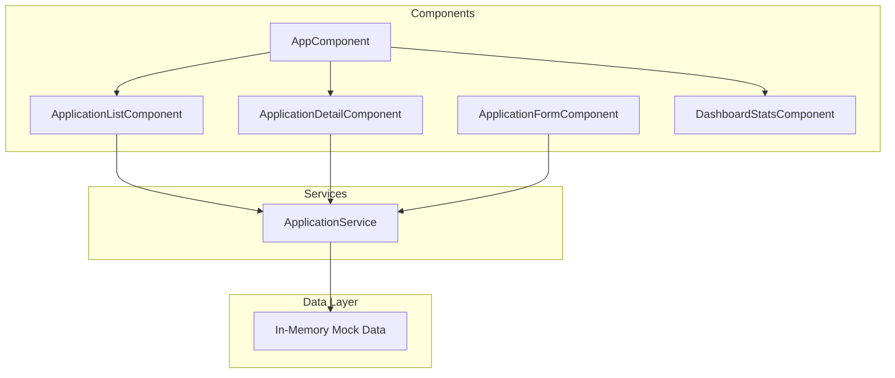

# Job Application Tracker – Angular Phase

## Goals

- Learn Angular by building a portfolio-ready Job Application Tracker
- Use mock/in-memory data (no backend yet)
- Structure services and models so adding a Java REST API later is straightforward

---

## Data Model

Each **Job Application** has:

- `id`, `company`, `position`, `status` (Applied | Interview | Offered | Rejected)
- `appliedDate`, `notes`, `jobUrl` (optional), `salary` (optional)

---

## Architecture




---

## Phase 1: Project Setup and Core Structure

### 1.1 Initialize Angular Project

- Run `ng new job-tracker` (standalone components, SCSS, strict mode)
- Add Angular Material or Tailwind for styling (pick one; Material is common for Angular)

### 1.2 Create Data Model and Mock Service

- **Model**: `src/app/models/application.model.ts` – interface for `JobApplication`
- **Service**: `src/app/services/application.service.ts` – CRUD methods returning `Observable` (simulating async; ready for HTTP swap later)
- **Mock data**: Hardcoded array of 3–5 sample applications in the service

---

## Phase 2: Main Views and Routing

### 2.1 Layout and Routing

- **Routes**:
  - `/` – Dashboard (list + stats)
  - `/applications` – Full list view
  - `/applications/new` – Add new application
  - `/applications/:id` – View/edit single application

### 2.2 Dashboard Page

- **DashboardStatsComponent**: Counts by status (Applied, Interview, Offered, Rejected)
- **ApplicationListComponent**: Table or cards showing recent applications; click row to go to detail

### 2.3 Application List Page

- Reuse `ApplicationListComponent` with filters (status, search by company/position)
- "Add Application" button → navigates to `/applications/new`

---

## Phase 3: CRUD and Forms

### 3.1 Application Form (Reactive Forms)

- **ApplicationFormComponent**: Form with company, position, status, appliedDate, notes, jobUrl
- Used for both Create and Edit (same component, different mode via route param)
- Basic validation: required company, position, status

### 3.2 Detail View

- **ApplicationDetailComponent**: Show all fields; Edit and Delete buttons
- Edit → navigate to `/applications/:id/edit` (or reuse form in modal/same page)
- Delete → confirm, then call service and navigate back to list

---

## Phase 4: Polish and Portfolio Readiness

### 4.1 UX Improvements

- Loading indicators when "fetching" (even with mock data)
- Empty state when no applications
- Basic status badges/chips for visual clarity

### 4.2 README and Structure

- `README.md` with project description, how to run, and screenshots
- Folder structure:
  - `src/app/models/`
  - `src/app/services/`
  - `src/app/components/`
  - `src/app/pages/` (or feature modules if preferred)

---

## Suggested Folder Structure

```
src/app/
├── models/
│   └── application.model.ts
├── services/
│   └── application.service.ts
├── components/
│   ├── application-list/
│   ├── application-detail/
│   ├── application-form/
│   └── dashboard-stats/
├── pages/
│   ├── dashboard/
│   ├── application-list-page/
│   └── application-detail-page/
├── app.component.ts
├── app.routes.ts
└── app.config.ts
```

---

## Future: Java Backend (Not in This Plan)

When you add Java later:

- Replace `ApplicationService` HTTP calls with `HttpClient.get/post/put/delete` to Spring Boot REST API
- Keep the same `JobApplication` interface (ensure field names match API)
- Add auth (JWT) and guards when ready

---

## Implementation Order


| Step | Task                                                   | Concepts                   |
| ---- | ------------------------------------------------------ | -------------------------- |
| 1    | Create project, add Application model and mock service | Models, Services, RxJS     |
| 2    | Set up routes and layout (header, nav)                 | Routing                    |
| 3    | Build DashboardStatsComponent                          | Components, async pipe     |
| 4    | Build ApplicationListComponent                         | *ngFor, *ngIf, routerLink  |
| 5    | Build ApplicationFormComponent                         | Reactive Forms, validation |
| 6    | Build ApplicationDetailComponent                       | ActivatedRoute, params     |
| 7    | Wire up full CRUD and navigation                       | Service methods, routing   |
| 8    | Add filters, empty states, README                      | Polish, documentation      |


