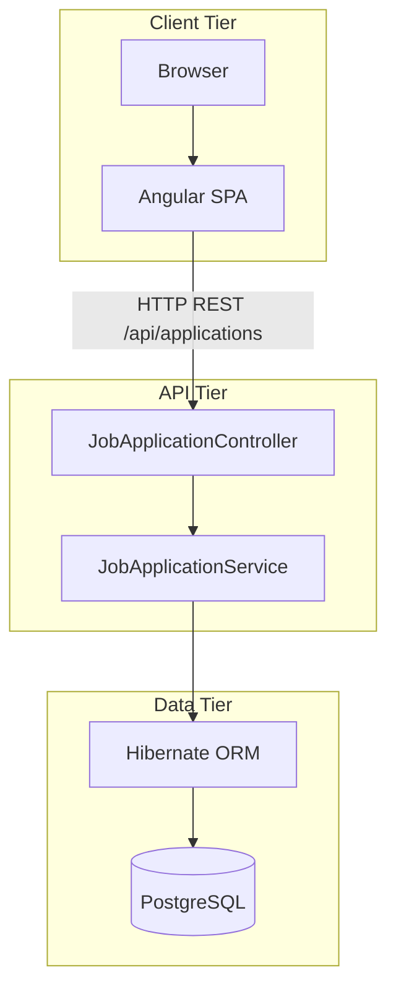
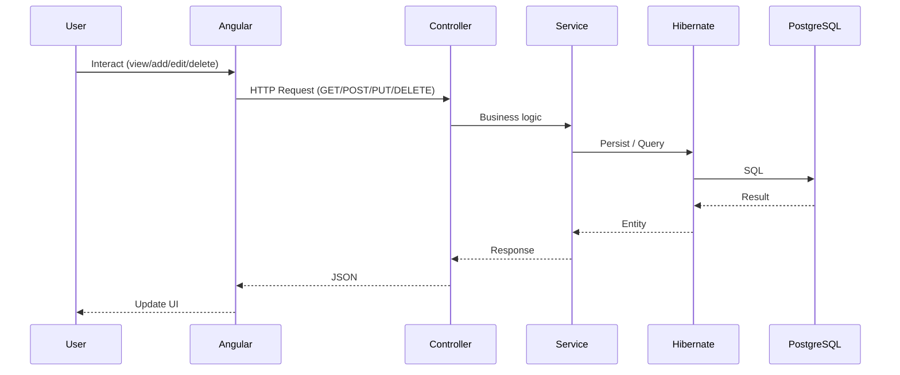

# Job Application Tracker

A portfolio-ready Angular application for tracking job applications through their lifecycle. Built with Angular (standalone components) and a Java/Spring Boot backend with PostgreSQL.

## System Diagram



### Request Flow



## Features

- **Dashboard** – Overview with application counts by status and recent applications
- **Applications list** – View all applications with filters (status) and search (company/position)
- **Add/Edit application** – Form with validation (company, position, status, date, notes, URL, salary)
- **Application detail** – View full details with Edit and Delete
- **Empty state** – Friendly message when no applications exist
- **Status badges** – Visual indicators for Applied, Interview, Offered, Rejected

## Tech Stack

- **Frontend**: Angular 21, RxJS, Reactive Forms
- **Backend**: Java 21, Spring Boot, Spring Data JPA
- **Database**: PostgreSQL with Hibernate ORM

## Getting Started

### Prerequisites

- Node.js 18+, npm
- Java 21+
- PostgreSQL 14+
- Maven

### 1. Database Setup

Create the database and configure credentials:

```sql
CREATE DATABASE jobtracker;
```

Copy `backend/src/main/resources/application.properties` or create `application-local.properties` in the same folder with your PostgreSQL settings:

```properties
spring.datasource.url=jdbc:postgresql://localhost:5432/jobtracker
spring.datasource.username=your_username
spring.datasource.password=your_password
```

### 2. Backend

```bash
cd backend
mvn spring-boot:run
```

API runs at http://localhost:8080.

### 3. Frontend

```bash
npm install
npm start
```

Open [http://localhost:4200](http://localhost:4200) in your browser.

### Build

```bash
npm run build
```

Output is in `dist/`.

## Project Structure

```
job-tracker/
├── src/app/                    # Angular frontend
│   ├── models/
│   ├── services/               # HTTP client → backend API
│   ├── components/
│   └── pages/
└── backend/                    # Spring Boot API
    └── src/main/java/com/jobtracker/
        ├── controller/
        ├── service/
        ├── repository/
        ├── entity/
        └── dto/
```

## License

MIT
