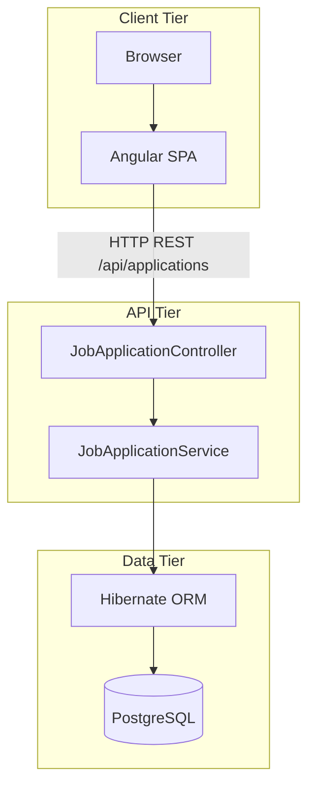
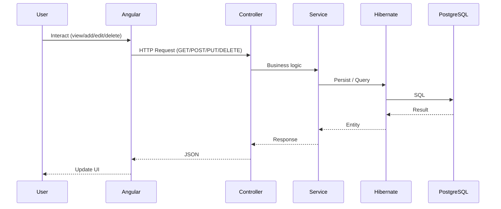

# Job Application Tracker

A portfolio-ready Angular application for tracking job applications through their lifecycle. Built with Angular (standalone components) and a Java/Spring Boot backend with PostgreSQL.

## System Diagram



### Request Flow



## Features

- **Dashboard** – Overview with application counts by status and recent applications
- **Applications list** – View all applications with filters (status) and search (company/position)
- **Add/Edit application** – Form with validation (company, position, status, date, notes, URL, salary)
- **Application detail** – View full details with Edit and Delete
- **Empty state** – Friendly message when no applications exist
- **Status badges** – Visual indicators for Applied, Interview, Offered, Rejected

## Tech Stack

- Angular 21 (standalone components)
- RxJS for async data
- Reactive Forms with validation
- In-memory mock data (backend-ready structure)

## Getting Started

### Prerequisites

- Node.js 18+
- npm

### Install and Run

```bash
npm install
npm start
```

Open [http://localhost:4200](http://localhost:4200) in your browser.

### Build

```bash
npm run build
```

Output is in `dist/`.

## Project Structure

```
src/app/
├── models/
│   └── application.model.ts    # JobApplication interface
├── services/
│   └── application.service.ts  # CRUD with mock data
├── components/
│   ├── layout/
│   ├── dashboard-stats/
│   ├── application-list/
│   ├── application-detail/
│   └── application-form/
├── pages/
│   ├── dashboard/
│   ├── application-list-page/
│   ├── application-form-page/
│   └── application-detail-page/
└── app.routes.ts
```

## Future: Java Backend

The service layer is structured so you can:

1. Replace in-memory CRUD with `HttpClient` calls to a Spring Boot REST API
2. Keep the same `JobApplication` interface (align field names with API)
3. Add authentication (JWT) and route guards when ready

## License

MIT
